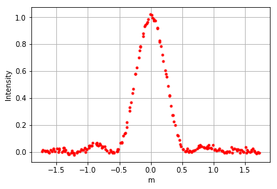
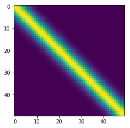
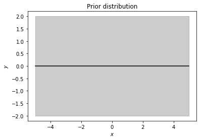
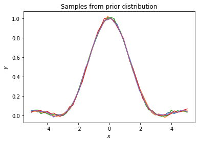
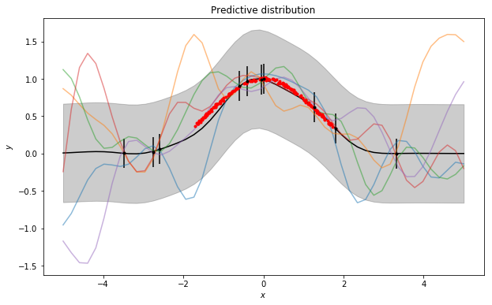
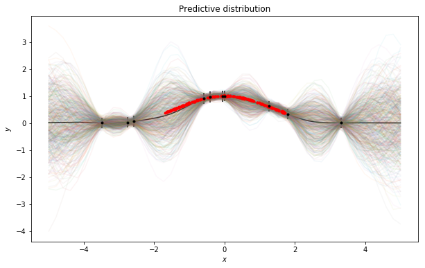

## Apply NN to recover the theory of diffraction

- Dongming Jin, a side project at HACKTX 


My idea is that morden science is closely related to technical innovation. But back in the 20th century, mechanical engineering and manufactory is still in the infancy, as well as data sampling and analytic methods. Even though the foundation of morden science is considered solid and proven, there is still chance that the perspective we have is not the only solution. Just like Newtonian gravity theory is an approximation of general relativity. 

To explore and test it out, I first decide to do a simulation based on established theory to get example data. Diffraction is one of the most classic phenomenon that is well explained but also is explosured to the dawn of Quantum mechanics. To make it more realistic, I add white noise as systemactical error due to measurement and try to use ML, (a straightforward neural network in this case) to reveal the nature of the problem. But due to the high percision it required to realize the numerical experiment, I run into some data format issue that couldn't be solved in short timeframe. 

So I decide to use gaussian process regression with the morden statistical method, Bayesian inference to catch the hidden nature from a small uniform random sampling data set. I put flat prior to avoid any prejustical knowledge about model and GP returned a reasonable good result, without excluding the possibility of alternative diffraction theory. See Cell 43 and Cell 45. The red dots are sampled based on theory, black dots with flat error bar are the data used to explore the model space. The _color density_ indicates the probability and Cell 26 shows the fructuation from measurement. 

My next step is to establish a mechanical system based on raspberrypi and step motor to stimulate in real case. Use the data measured in a large scale to revisit my temperate conclusion. 


### REF
* [paper about Optics simulations with python](https://www.osapublishing.org/DirectPDFAccess/47E6CA42-FADB-6891-CA9B67A17E5174B4_354793/ETOP-2015-DTE14.pdf?da=1&id=354793&uri=ETOP-2015-DTE14&seq=0&mobile=no)

* [github for python code](https://github.com/kalekundert/DoubleSlit)

* [wiki about diffraction](https://en.wikipedia.org/wiki/Diffraction)


```python
%pylab inline
from decimal import Decimal
import math
```

    Populating the interactive namespace from numpy and matplotlib


### 1-D diffraction

$\frac{I(x)}{I(0)}= \left[ \frac{\sin(\frac{\pi b}{\lambda}\frac{x}{D}) }{(\frac{\pi b}{\lambda} \frac{x}{D} )} \right]^2$

* $b$: slit width
* $\lambda$: wavelength
* $D$: distance to screen





### Prior 

#### Correlation



#### Distribution



#### Sample from simulation



### Prediction using Gaussion Processing models




### MCMC generated possible model based on limited sample




## Interpretion

* There is room for alternative form of diffraction equation, but sampling is very biased and uneven
* Flat prior, is too big.
* Gaussian process regression can incooperate with biased sampling, which is more realistic
* I need to work with TensorFlow
